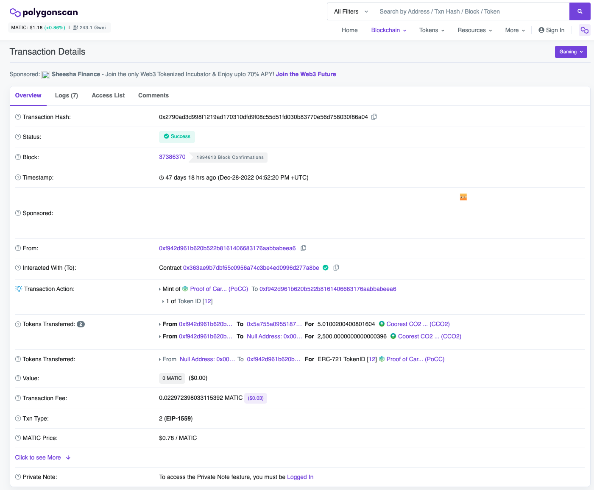
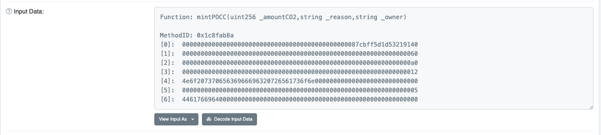
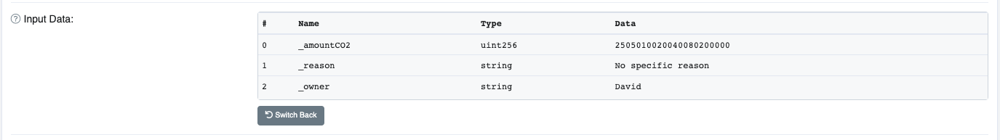

# Coorest token retirements

Let’s go through [this example transaction](https://polygonscan.com/tx/0x2790ad3d998f1219ad170310dfd9f08c55d51fd030b83770e56d758030f86a04), which is the creation of a Coorest Proof-of-carbon compensation (POCC) certificate, representing the offset of 2.5 tons of CO2 equivalents.

- The transaction hash (`0x2790ad3d998f1219ad170310dfd9f08c55d51fd030b83770e56d758030f86a04`) is a unique identifier for the specific offset action. This enables you to find it on any block explorer, and verify that it is distinct from any other offset transactions you see.
- “Tokens Transferred” shows you three transfers of tokens:
    - the first line is a small fee paid to Coorest to cover the blockchain computation cost for this transaction. The amount varies depending on how in-demand the blockchain is at any point in time.
    - The second line is the transfer of the amount of offset tokens requested (2500 in this case, each token being 1kg) to the “null address”. On Polygon, the null address is an address that nobody owns, nor can own. **Any tokens sent to it are permanently and irretrievably lost. This transfer is the “retirement” component of this transaction.**
    - The third line, with a different token type, shows the minting of a proof-of-carbon certificate non-fungible token for this transaction, which is held in the Arbon wallet.
The final bit of critical info only appears when you “Click to see more” towards the bottom.

Down there, you find a field called “Input Data” which has the text Function: mintPOCC(uint256 _amountCO2,string _reason,string _owner) followed by a bunch of numbers. This is the binary representation of the input data we are interested in.

If you click “Decode input data”, you will see the amount requested, the reason given and the entity that generated this retirement request. These have been written permanently into the blockchain in this form.

